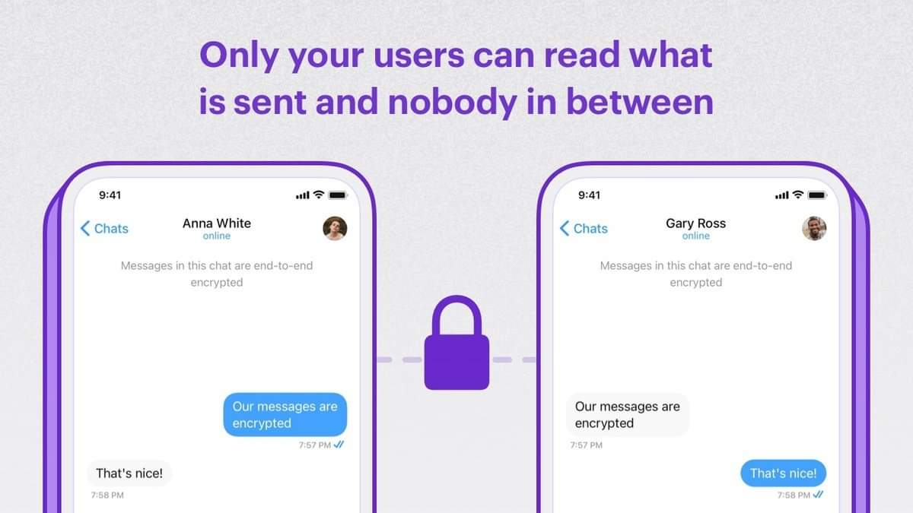

<p align="center">
  
</p>

# CometChat End-to-end Encryption Sample App (React)



[](https://github.com/cometchat-pro/cometchat-pro-react-sample-app/releases/)
[](https://img.shields.io/github/languages/top/cometchat-pro/cometchat-pro-react-sample-app)
[](https://github.com/cometchat-pro/cometchat-pro-react-sample-app/stargazers)
[](https://twitter.com/CometChat)

CometChat End-to-end Encryption Sample App (built using **CometChat UI Kit**) is a fully functional real-time messaging app capable of Encrypted private (one-on-one) & group text messaging using the [Virgil's E3Kit](https://virgilsecurity.com/e3kit/).

## Features

- Login
- Encrypted Private(1-1) & Group text messages

---

## Prerequisites

**React setup**

- React
  ```bash
  npm install react@17.0.2
  ```
- React DOM
  ```bash
  npm install react-dom@17.0.2
  ```
- React App Rewired
  ```bash
  npm install --save-dev react-app-rewired
  ```
- Replace `react-scripts` with `react-app-rewired`

  ```diff
  /* package.json */

  "scripts": {
  -   "start": "react-scripts start",
  +   "start": "react-app-rewired start",
  -   "build": "react-scripts build",
  +   "build": "react-app-rewired build",
  -   "test": "react-scripts test",
  +   "test": "react-app-rewired test",
      "eject": "react-scripts eject"
  }
  ```

**Node sass**

- Add node-sass dependency in your project.

  ```javascript
  npm install --save-dev node-sass@version
  ```

  **Note**: Cross check for the compatible version of this dependency with your system's node version in the link given below  
  [https://www.npmjs.com/package/node-sass](https://www.npmjs.com/package/node-sass)

**Client-side Virgil setup**

- Virgil E3Kit
  ```bash
  npm install @virgilsecurity/e3kit-browser
  ```
- File loader
  ```bash
  npm install --save-dev file-loader
  ```
- Create a file named `config-overrides.js` along-side `package.json` & paste the below content:

  ```javascript
  module.exports = (config, env) => {
    config.module.rules[1].oneOf.unshift({
      test: /\.wasm$/,
      type: 'javascript/auto',
      loader: 'file-loader',
    });
    return config;
  };
  ```

**Virgil Dashboard & Extension settings:**

- Sign up or Log in with [Virgil](https://dashboard.virgilsecurity.com/apps).
- Create a new application.
- Go to E3Kit section & create the .env file. Copy the following details:
  - APP_ID
  - APP_KEY_ID
  - APP_KEY
- Login to [CometChat Dashboard](https://app.cometchat.com) & select your app.
- Go to the Extensions section & enable the End-to-end encryption extension.
- Open the Settings for this extension & save the following:
  - APP_ID
  - APP_KEY_ID
  - APP_KEY
- Save your settings.

---

## Installing the Sample App

1. Clone this repository
   ```bash
   git clone https://github.com/cometchat-pro/javascript-react-chat-end-to-end-encryption-app.git
   ```
2. Navigate to the root directory & replace `APP_ID`, `REGION` & `AUTH_KEY` with your CometChat app's `App ID`, `Region` & `Auth Key` in `src/consts.js` file.

   

3. Install dependencies:

   ```javascript
   npm install
   ```

---

## Running the sample app

```javascript
  npm start
```

---

## Troubleshooting

- To learn more about the End-to-end encryption extension visit our [Documentation](https://www.cometchat.com/docs/extensions/end-to-end-encryption).

- Facing any issues while integration? Please connect with us via real-time support present in the [CometChat Dashboard](https://app.cometchat.com).

---

## Contributors

Thanks to the following people who have contributed to this project:

[@priyadarshininadar](https://github.com/priyadarshininadar)  
[@ajaygajra](https://github.com/ajaygajra)  
[@prathamesh-majgaonkar](https://github.com/prathamesh-majgaonkar)  
[@shubhamsingh-CometChat](https://github.com/shubhamsingh-CometChat)  
[@mayur-bhandari](https://github.com/mayur-bhandari)

---

## Contact

Contact us via real time support present in the [CometChat Dashboard](https://app.cometchat.com/).

---

# License

This project uses the following [license](https://github.com/cometchat-pro/javascript-react-chat-end-to-end-encryption-app/blob/master/LICENSE).
